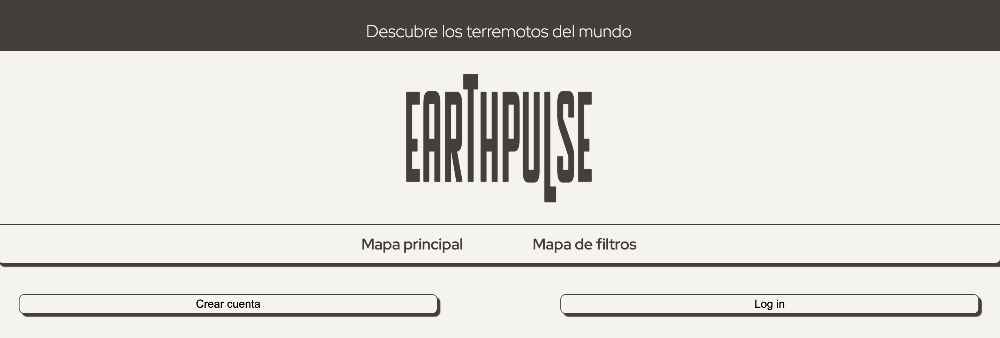

# Web de Terremotos

## 💨 Introducción

Esta web permite visualizar terremotos recientes en un mapa interactivo, mostrando información relevante de cada evento. El proyecto combina manipulación dinámica del DOM, consumo de APIs y la posibilidad de integrar Firebase para almacenamiento y gestión de datos en tiempo real.

## 👩🏼‍🏫 Instrucciónes de uso

Esta web ha sido desarrollada para que puedas navegar, descubrir y guardas tus terremotos favoritos. Quizás al principio te resulte un poco abrumadora pero no te preocupes, te dejamos los pasos que debes seguir para disfrutar de ella al maximo:

1. 👩🏼‍💻 Crea una cuenta: Podrás ver todos los terremotos a tiempo real aunque no crees una cuenta pero no podras guardarlos como favoritos para verlos mas tarde.
2. 🌍 Una vez te registes tendras que iniciar sesión. De esta manera cuando pinches en un pin del mapa ya podrás guardarlo.
3. ⭐️ Podrás ver y eliminar tus terremotos favoritos en el boton de la esquina superior derecha llamado "Terremotos favoritos" y volver a ver todos en el boton del lado izquiero "Todos los terremotos"
4. 🗺️ El segundo mapa esta diseñado para que busques tus terremotos en base a su magnitus, fecha o ambas a la vez.

¡Ya estas listo/a para empezar a descubrir!

## 📂 Requisitos para este proyecto

- Manipulación dinámica del DOM
- Manejo de ES6
- Asincronía
- Sin frameworks ni librerias externas en la medida de lo posible
- Gestión del proyecto en Github desde el principio. Uso de ramas.
- Código limpio, buenas prácticas
- Diseño responsive, mobile first, semántica HTML5

**Opcional**
- Otras APIs, Local Storage, Firebase, PWA...
- En general, cualquier extra será bien recibido para que investiguéis por vuestra cuenta, siempre y cuando tenga sentido

## Diseño mobile first y responsive

## 🎯 Objetivos

| Objetivo | Definición | Estado |
|----------|------------|--------|
| Mapa 1 | Mostrar terremotos en Leaflet con popup y marcadores coloreados según magnitud | Conseguido ✅ |
| Mapa 2 | Filtrar terremotos por magnitud y fechas de inicio/fin | Conseguido ✅ |
| Favoritos | Guardar terremotos favoritos en Firebase Firestore desde el popup | Conseguido ✅ |
| Botones vista | Alternar entre vista de API y favoritos | Conseguido ✅ |
| Gestión favoritos | Eliminar favoritos y evitar duplicados | Conseguido ✅ |
| Autenticación | Solo usuarios autenticados pueden guardar favoritos | Conseguido ✅ |
| Privacidad | Cada usuario ve únicamente sus propios favoritos | Conseguido ✅ |
| Carga y visualización | Animación durante la carga y mostrar ambos mapas al iniciar | ⬜ |

## 🖥️ Link para Github Pages

https://rebecadiazmontenegro.github.io/Web-de-Terremotos-/

## 👩🏼‍💻 Autora
- Nombre: Rebeca
- Apellidos: Díaz-Montenegro Sánchez
- Linkdin: https://www.linkedin.com/in/rebeca-diaz-montenegro-s%C3%A1nchez-818515245/